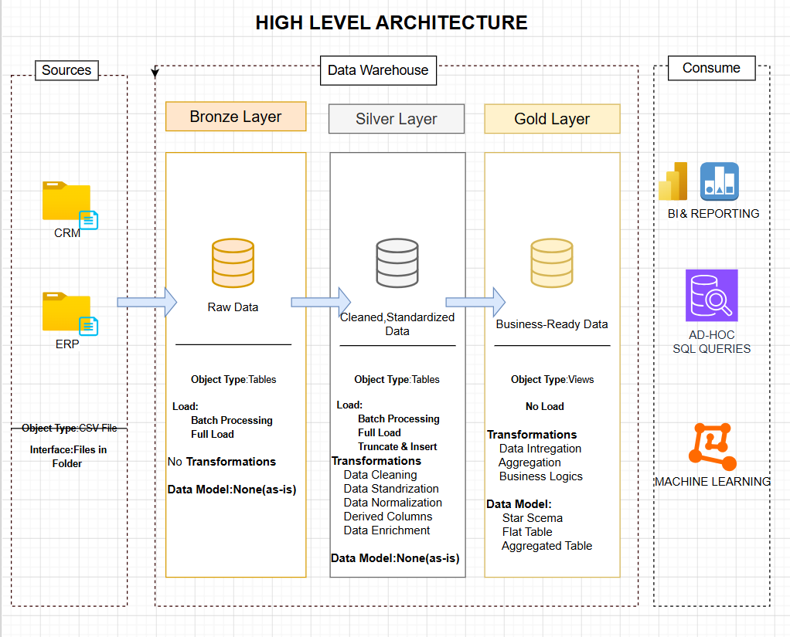
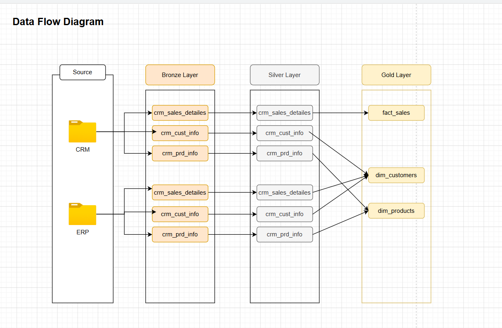
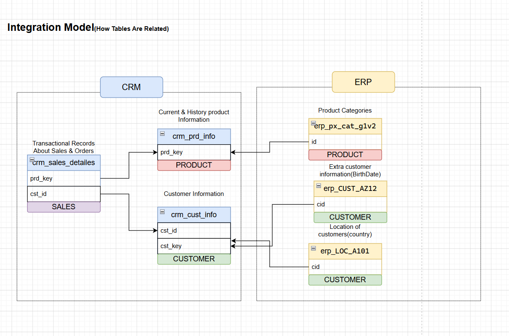
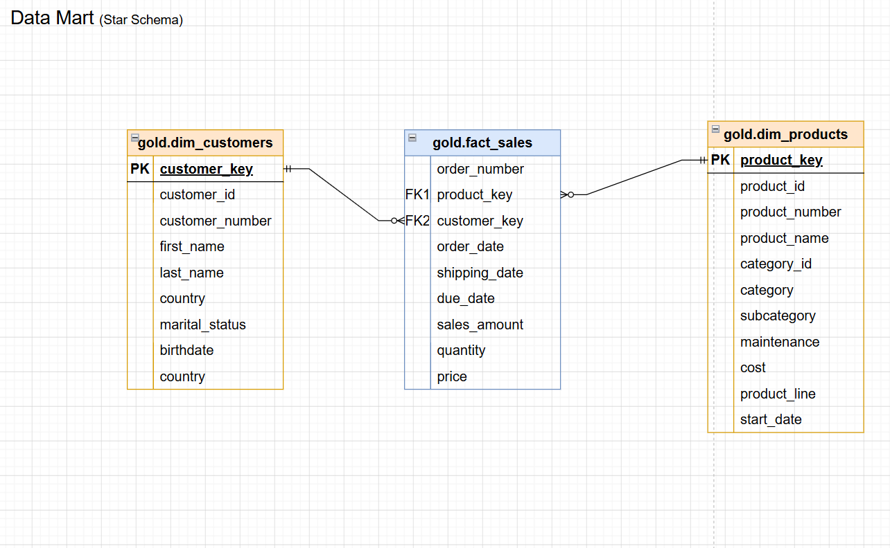

# SQL Data Warehouse and Analytics Project

## Overview

This repository contains a complete SQL Data Warehouse project developed as part of my Data Engineering and Data Analytics learning journey.

The project demonstrates end-to-end implementation of:

* Data Warehousing
* ETL Development
* Medallion Architecture (Bronze, Silver, Gold)
* Data Modeling
* Data Cleaning & Transformation
* Data Quality Validation
* Analytics-Ready Data Preparation
* SQL Development Best Practices

The objective is to transform raw CRM and ERP data into clean, structured, and business-ready datasets for reporting and analytics.

---

## Key Features

* Multi-source CRM and ERP data integration
* Medallion Architecture (Bronze, Silver, Gold)
* Data cleansing and standardization
* Star schema dimensional modeling
* Data quality validation scripts
* Business-ready analytical views
* Comprehensive project documentation
* SQL Server implementation using T-SQL

---

## Project Requirements

### Building the Data Warehouse (Data Engineering)

#### Objective

Develop a modern Data Warehouse using SQL Server to consolidate data from multiple source systems and support analytical reporting.

#### Specifications

* Import data from CRM and ERP systems
* Store raw data in the Bronze Layer
* Clean and standardize data in the Silver Layer
* Create business-ready datasets in the Gold Layer
* Apply data quality checks and transformations
* Follow Data Warehouse best practices
* Document architecture and naming conventions

---

### Analytics & Reporting (Data Analytics)

#### Objective

Develop reporting-ready datasets for business intelligence and analytics.

#### Expected Insights

* Customer Analysis
* Product Analysis
* Sales Analysis
* Business Performance Tracking
* Trend Analysis

---

## Architecture

The project follows the Medallion Architecture approach.

```text
CRM / ERP Sources
        │
        ▼
+----------------+
| Bronze Layer   |
| Raw Data       |
+----------------+
        │
        ▼
+----------------+
| Silver Layer   |
| Clean Data     |
+----------------+
        │
        ▼
+----------------+
| Gold Layer     |
| Business Data  |
+----------------+
        │
        ▼
Power BI / Analytics
```

---

## Project Documentation

### Data Architecture



### Data Flow



### Data Integration



### Data Model



---

## Data Warehouse Layers

### Bronze Layer

#### Purpose

* Store raw source data
* Preserve original records
* Support debugging and traceability

#### Characteristics

* Raw Data
* Full Load Processing
* No Transformations
* Source-Aligned Tables

#### Examples

```sql
crm_cust_info
crm_prd_info
crm_sales_details

erp_cust_az12
erp_loc_a101
erp_px_cat_g1v2
```

---

### Silver Layer

#### Purpose

* Clean and standardize source data
* Prepare data for analytics

#### Transformations

* Data Cleaning
* Standardization
* Data Validation
* Data Enrichment
* Derived Columns

---

### Gold Layer

#### Purpose

* Deliver business-ready datasets
* Support reporting and analytics

#### Transformations

* Data Integration
* Business Rules
* Aggregations
* Dimensional Modeling

#### Examples

```sql
dim_customers
dim_products
fact_sales
```

---

## Naming Conventions

### General Rules

* Use snake_case naming
* Use lowercase letters
* Use meaningful business names
* Avoid SQL reserved keywords

#### Example

```sql
customer_name
sales_amount
order_date
```

### Bronze Layer Naming

```sql
<source_system>_<entity>
```

#### Examples

```sql
crm_cust_info
crm_prd_info
crm_sales_details

erp_cust_az12
erp_loc_a101
erp_px_cat_g1v2
```

### Gold Layer Naming

#### Dimension Tables

```sql
dim_customers
dim_products
```

#### Fact Tables

```sql
fact_sales
```

### Technical Columns

```sql
dwh_<column_name>
```

#### Examples

```sql
dwh_load_date
dwh_insert_date
dwh_update_date
```

### Surrogate Keys

```sql
<table_name>_key
```

#### Examples

```sql
customer_key
product_key
```

---

## Repository Structure

```text
SQL-DATA-WAREHOUSE-PROJECT
│
├── datasets
│   ├── cust_info.csv
│   ├── prd_info.csv
│   ├── sales_details.csv
│   ├── CUST_AZ12.csv
│   ├── LOC_A101.csv
│   └── PX_CAT_G1V2.csv
│
├── docs
│   ├── data_architecture.png
│   ├── data_flow.png
│   ├── data_integration.png
│   ├── data_model.png
│   ├── data_catalog.md
│   └── naming_conventions.md
│
├── scripts
│   ├── bronze
│   ├── silver
│   ├── gold
│   └── init_database.sql
│
├── tests
│   ├── quality_checks_silver.sql
│   └── quality_checks_gold.sql
│
└── README.md
```

---

## Technology Stack

* SQL Server
* T-SQL
* Git
* GitHub
* Draw.io
* CSV Files
* Power BI (Planned)

---

## Data Quality Checks

The project includes automated validation scripts to ensure:

* No duplicate business keys
* No NULL values in critical columns
* Consistent data formats
* Referential integrity checks
* Gold Layer validation checks

Scripts are available in:

```text
tests/
├── quality_checks_silver.sql
└── quality_checks_gold.sql
```

---

## Future Improvements

* Incremental Loading
* Stored Procedure Automation
* Data Quality Framework
* Power BI Dashboard Development
* Azure Data Factory Integration
* Cloud Deployment on Azure

---

## About Me

Hi, I'm **Yashwanth Samineni**.

I am a recent B.Tech graduate passionate about:

* Data Analytics
* SQL Development
* Data Warehousing
* Business Intelligence
* Data Engineering

This repository showcases my practical learning journey in SQL, Data Warehousing, ETL Development, and Analytics using SQL Server.

---

## License

This project is licensed under the MIT License.
